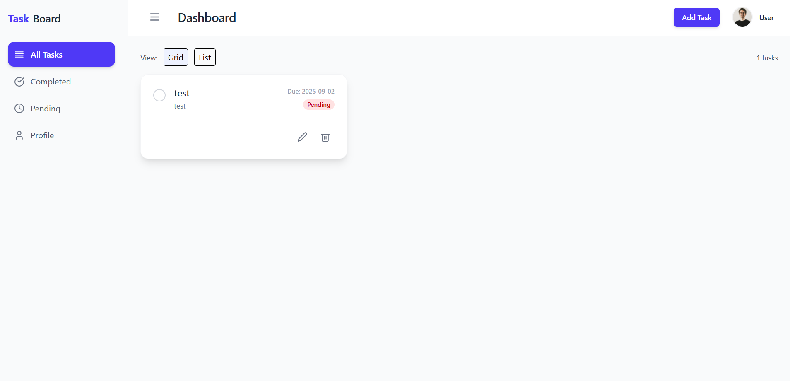

# 📋 Task Management Dashboard (React + Firebase)

A simple and visually appealing **Task Management Dashboard** built with **React**, **Tailwind CSS**, and **Firebase** (Firestore + Storage).  
Users can manage tasks (CRUD), switch between grid/list views, and update their profile with name and picture.

---

## 🚀 Features

### ✅ Task Management

- Add, edit, and delete tasks.
- Mark tasks as **Completed** or **Pending**.
- View tasks in **Grid** or **List** layout.
- Tasks stored in **Firebase Firestore** with real-time updates.

### 👤 Profile Management

- Update user **name** and **profile picture**.
- Profile data stored in Firestore.
- (Optional) Profile picture upload to Firebase Storage.

### 🎨 UI

- Dashboard layout with:
  - Sidebar (All, Completed, Pending, Profile)
  - Header (user details + Add Task button)
  - Main content area (tasks or profile form)
- Built using **Tailwind CSS**.

---

## 🛠️ Tech Stack

- **Frontend:** React, Tailwind CSS
- **Backend (Database):** Firebase Firestore
- **Storage:** Firebase Storage (for profile pictures)

---

## 📂 Project Structure

```
src/
├── components/
│ ├── Header.jsx
│ ├── Modal.jsx
│ ├── ProfileForm.jsx
│ ├── Sidebar.jsx
│ ├── TaskCard.jsx
│ └── TaskForm.jsx
├── services/
│ └── firebase.js
├── App.jsx
└── index.js
```

## 📸 Screenshots

### Dashboard View


